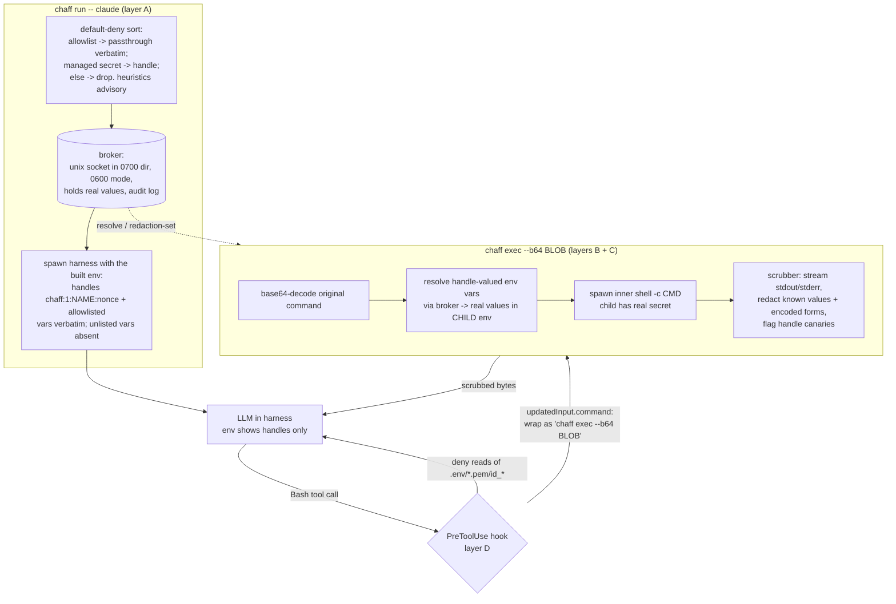

# Plan: `chaff` — keep env-var secrets out of LLM histories

> Working name `chaff`; rename freely. **Standalone tool**, separate from
> commonplace — commonplace is only a structural reference for "small, simple,
> local, AI-coding-adjacent" (thin bins over testable modules, strict env
> resolution, pnpm + vitest + Makefile, local-first, no cloud).

## Status

Plan + four design decisions locked from review (2026-05-23). Decisions are
folded into the relevant sections below and summarized in
[Design decisions from review](#design-decisions-from-review). No code yet;
repo is not yet `git init`-ed.

## Context

When an LLM coding harness (Claude Code, etc.) runs in a shell that already has
secrets in its environment (`OPENAI_API_KEY`, `DATABASE_URL`, `*_TOKEN`), those
secrets leak into the model's transcript — which is sent to the provider and
persisted. A secret is "leaked" the instant its bytes land in a tool result.

The core reframing: **the orchestrator (LLM) and the workload (the programs it
runs) are different principals.** The LLM only needs to _cause_ a secret to be
used; the child process needs the real value. So we let the LLM compose and
trigger commands that consume secrets without the bytes ever entering the
transcript.

**Threat model: accidental leakage only.** Keep secrets out of the history under
normal/buggy operation (misconfigured scripts, crash dumps, `set -x`, an LLM
that runs `echo $KEY`). We are explicitly **not** trying to confine a hostile
workload that actively exfiltrates — a child holding the real secret can always
transform it or open its own socket. Best-effort scrubbing is the right bar.

### Two leak channels (drives the whole design)

1. **Pull** — LLM runs `env` / `echo $KEY` / `cat .env`. Fixed by a
   _default-deny_ harness env (see "Layer A" below): only allowlisted vars pass
   through verbatim, managed secrets become handles, and everything else is
   dropped — so the harness env holds references or nothing, never raw values.
2. **Push** — a child process _emits_ the secret (stack trace with a DB URL,
   debug log). Fixed _only_ by _egress scrubbing_: a filter that knows the real
   values and redacts them before capture.

## The enforced path

`PostToolUse` cannot rewrite output, so scrubbing must happen _before_ the
harness captures it. `PreToolUse` _can_ rewrite a command (via
`hookSpecificOutput.updatedInput.command`), so every Bash command is
transparently wrapped to run under `chaff exec`, which both injects secrets for
the child and scrubs the child's stdout/stderr upstream of capture.

> **Verified (2026-05-23):** Claude Code `PreToolUse` supports rewriting the
> Bash `command` via `hookSpecificOutput.updatedInput.command`, and denying via
> `hookSpecificOutput.permissionDecision: "deny"` + `permissionDecisionReason`.
> The scrubbing mechanism is **Bash-only by construction** — see decision #4.



## Layer A — default-deny harness env

`chaff run` builds the harness env under a **default-deny** posture (decision
`chaff_decision_default_deny_env`). Each var in the launch-time env snapshot is
sorted into exactly one of three buckets:

- **passthrough** — name is on the effective allowlist → value passed through
  **verbatim**. The shipped default allowlist is the benign terminal/locale/path
  plumbing a shell and ordinary tools need: `PATH`, `HOME`, `SHELL`, `TERM`,
  `LANG`, `LC_*`, `TZ`, `TMPDIR`, `USER`, `LOGNAME`, `PWD`, `XDG_*`. User/folder
  config extends this set later (DAR-1140).
- **handle** — a managed secret (**detected-secret ∪ declared-managed**) →
  replaced by a `chaff:1:NAME:nonce` handle, the real value seeded to the
  broker. `declaredManaged` is a parameter here, defaulting to empty.
- **dropped** — neither allowlisted nor a managed secret → **absent** from the
  harness env entirely (both name and value). `CHAFF_SOCK` is always added.

This is the deliberate inversion of the earlier denylist framing (DAR-1094 /
DAR-1100, where every non-secret var passed through verbatim). The detection
heuristics (globs / allowlist / entropy in `policy.ts`) are **reused but
demoted from load-bearing to advisory**: they suggest the managed set and raise
a tripwire warning, but they no longer decide what is safe to expose.

**Handles come only from a NAME signal.** A var becomes a handle iff its name
matches a secret-shaped glob (like `*_TOKEN`) **or** it is declared-managed.
The **entropy backstop never sources a handle** (DAR-1148): it is a guess from
the _value_, not the name, and under default-deny it is no longer load-bearing
for safety — a missed unknown is _dropped_, not leaked, the same non-leaking
outcome a handle would give. Demoting it makes all unknowns consistent: not
allowlisted ∧ not a name signal ⇒ **dropped**, regardless of entropy. This also
keeps benign high-entropy values (`LS_COLORS`, a long `GOROOT`, `npm_package_*`,
a realistic `TMPDIR` `/var/folders/...`) out of the broker and (Phase 3) the
redaction set, where they would otherwise corrupt legitimate child output.

**Fail-safe over fail-open.** A secret the heuristics miss _and_ nobody
allowlisted is **dropped** — a tool may break, visibly — rather than leaked.
When a _dropped_ var's value looks high-entropy, a name-only **advisory** is
surfaced (launch banner + `chaff scan`) — e.g. "FOO looks secret-like and was
dropped; declare it managed or allowlist it if a tool needs it" — so an
oddly-named undeclared secret is discoverable rather than silently broken; the
advisory names the var, never its value.

**Precedence:** a var that is both allowlisted _and_ a name-signal secret (a
secret-shaped glob, or declared-managed) is treated as a **handle** (never pass
a name-signalled secret-looking value through), with an advisory warning naming
it. An allowlisted var whose only secret signal is high entropy (like `TMPDIR`)
passes through **verbatim with no warning** — the allowlisted name is
authoritative and entropy no longer competes with it, so no allowlist-specific
entropy carve-out is needed. The launch banner reports per bucket —
passthrough **count**, handle **names**, dropped **count**, plus advisory
warnings — names only, never values, to stderr so it cannot contaminate the
harness's stdout.

## Project layout (mirror commonplace's shape)

New repo at `/Users/rick/Projects/github.com/rickbassham/chaff` (its own git
repo; **not** a PR into commonplace — no remote is assumed). TypeScript ESM,
Node >=20, pnpm, vitest, eslint, prettier, Makefile, thin bins over testable
modules. **No native deps** (pipe-based capture, not node-pty — harness Bash
calls are non-interactive, so a TTY isn't needed; and per decision #1 we no
longer need a native peer-cred addon).

```
src/
  bin/chaff.ts          # thin CLI dispatch: run | exec | scan | audit | install-hooks
  bin/chaff-hook.ts     # thin PreToolUse hook entry (reads hook JSON on stdin)
  policy.ts            # classify env vars as secret (globs, allowlist, entropy)
  broker.ts            # unix-socket server: resolve / list / redaction-set; fs-perms auth; audit
  launcher.ts          # `chaff run`: snapshot env, start broker, build handle-env, spawn harness
  exec.ts              # `chaff exec`: decode command, resolve handles into child env, spawn, scrub
  scrubber.ts          # streaming Transform: hold-back buffer + multi-pattern literal match
  encodings.ts         # per-secret variants: raw, base64 std/url +/-pad, percent, JSON-escape, hex
  hook.ts              # PreToolUse logic: base64-wrap Bash command; deny secret-file reads; idempotency guard
  handles.ts           # handle format + parse/format/isHandle helpers
  audit.ts             # JSONL audit log writer + `chaff audit` pretty-printer
tests/                 # vitest unit + integration
```

## Key design decisions

- **Handle format:** `chaff:1:NAME:NONCE` (12 hex chars). Charset
  `[A-Za-z0-9:_-]` so it survives shell/env round-trips. The random nonce makes
  the handle a unique **canary** and unguessable.

- **Broker auth — filesystem permissions only (decision #1).** No token in env
  (an `env` dump would leak it), and **no peer-cred check** — Node exposes no API
  for Unix-socket peer credentials (verified on v24.13.0: a live connection
  exposes only `_getpeername`, which returns `{}` for AF_UNIX), so peer-cred
  would force a native dep and platform-split code (`SO_PEERCRED` on Linux,
  `LOCAL_PEERCRED`/`getpeereid` on macOS), and `/proc/<pid>/cmdline` doesn't
  exist on macOS at all. Instead the trust boundary is the filesystem: a `0600`
  socket inside a `0700` per-session dir under `$XDG_RUNTIME_DIR` (fallback
  `/tmp`). Same-uid enforcement comes from the OS. This is sufficient for the
  accidental-leakage bar; peer-cred + pid-tree gating are noted hardening options
  (would require a native addon). Only `CHAFF_SOCK` (the socket path, not a
  secret) is exported to the harness.

- **Broker lives in the launcher process**, listening on the socket, torn down on
  harness exit — no daemon lifecycle, no stale sockets/orphans.

- **Broker ops:** `resolve(handle)->value` (for injection), `list()->names` (no
  values — mild metadata exposure, acceptable under the threat model),
  `redaction-set()->{patterns, handles}` (precomputed encoded forms for the
  scrubber, gated by redaction-eligibility per decision #3; encoding logic
  centralized here). All `resolve` calls are audit-logged broker-side with
  `{ts, op, secretName}` — **no peer pid/argv** (per decision #1, we can't read
  the peer without native code, and don't need to).

- **Scrubber (decision #3 changes what enters the redaction set):** streaming
  `Transform`. Maintain a sliding buffer; on each chunk, literal-match every
  redaction pattern (raw value + encoded variants from `encodings.ts`); replace
  with `[redacted:NAME]`; emit all but the trailing `maxPatternLen-1` bytes (the
  **hold-back buffer** that catches values split across `read()` boundaries);
  flush remainder on stream end. If a _handle_ string appears in output, emit a
  canary warning to chaff's own stderr + audit (signals a bypassed secret use).
  Start with indexOf-per-pattern (fine for dozens of secrets); Aho-Corasick noted
  as an optimization. **Redaction-eligibility is gated** — see decision #3.

- **Hook rewrite — base64-wrap (decision #2):** the hook emits
  `updatedInput.command = chaff exec --b64 '<blob>'` where
  `blob = base64(originalCommand)`. This is required, not cosmetic: the harness
  re-parses `updatedInput.command` through a shell, so a naive
  `chaff exec -- <cmd>` (a) lets the harness shell parse pipes/redirects/quotes
  before `chaff exec` sees them, and (b) expands `$VAR` in the _harness_ shell —
  where the var holds only the handle — so `tool --key $KEY` would receive the
  handle text and fail. Base64 defers both shell-parsing and `$VAR` expansion to
  the inner shell `chaff exec` spawns _with the real values in env_. In TS,
  `Buffer.from(cmd).toString('base64')` is single-line (no 76-col wrapping) and
  uses only `[A-Za-z0-9+/=]` (no shell metacharacters), so it is a single safe
  token; single-quote it anyway as insurance.

- **Hook idempotency:** if the command already starts with `chaff exec --b64 `,
  pass through unchanged (prevents double-wrapping / recursion). Inner shells
  spawned by `chaff exec` are normal subprocesses, not harness tool calls, so they
  never re-trigger the hook.

- **Secret-file reads:** the same `PreToolUse` hook matches `Read`/`Glob`/`Grep`
  on `.env*`, `*.pem`, `id_*`, `*.key`, `credentials*` and returns
  `permissionDecision: "deny"` with a `permissionDecisionReason`. (Partial
  mitigation of the sibling `.env`-file channel; see decision #4 for the limits.)

## Design decisions from review

Four decisions locked 2026-05-23 after walking the plan issue-by-issue. Each
changed the build, so they are recorded here as the rationale of record.

### #1 — Broker auth: filesystem permissions only (was: peer-cred + `/proc` audit)

**Why:** the original peer-cred design is unbuildable without native code and
isn't portable. Node has no peer-credential API (verified: live AF*UNIX
connection exposes only `_getpeername` → `{}`); `SO_PEERCRED` is Linux-only,
macOS uses `LOCAL_PEERCRED`/`getpeereid`; `/proc/<pid>/cmdline` doesn't exist on
macOS. For the \_accidental-leakage* threat model, a `0600` socket in a `0700`
per-session dir already enforces same-uid access via the OS; peer-cred would only
add defense against a same-uid _hostile_ process, which is out of scope.

**Decision:** fs-perms as the trust boundary. Audit lines are broker-side
(`{ts, op, secretName}`), no peer pid/argv. Peer-cred + pid-tree gating →
README "hardening (out of scope for v1, would need a native addon)." Keeps
"no native deps" honest. Shrinks `broker.ts` auth to "create socket in private
dir with right mode + verify on startup."

### #2 — Hook wraps the command via base64 (was: `chaff exec -- <command>`)

**Why:** the harness re-parses `updatedInput.command` through a shell. The naive
rewrite breaks two ways, both demonstrated: (a) `echo x | grep y` →
`(chaff exec -- echo x) | grep y` — the pipe is parsed by the harness shell, so
`grep` runs outside `chaff exec`; (b) `tool --key $KEY` → `$KEY` expands in the
harness shell to the _handle_, so the child gets the handle text and the tool
fails — defeating the tool's whole purpose. The plan's "resolve handle-valued
env vars into the child env" only helps programs that read `process.env`
directly (e.g. `python script.py`), not the common `tool --key $VAR` shape.

**Decision:** `hook.ts` emits `chaff exec --b64 '<base64(command)>'`; `exec.ts`
decodes, resolves handle env vars into the child env, then runs the decoded
string under the inner shell. Base64 defers shell-parsing _and_ `$VAR` expansion
to that inner shell, which has the real values. Idempotency guard becomes
`command.startsWith('chaff exec --b64 ')`.

**Open sub-decision:** which inner shell. Plan said `$SHELL` (often zsh on macOS),
but LLMs tend to write bash-isms; safest is to match the shell the harness itself
uses so semantics are identical end-to-end. Lean `bash`; confirm at Phase 4.

### #3 — Redaction-eligibility is separate from classification

**Why:** the plan's entropy backstop only decides _"is this a secret"_
(classification → gets a handle). It does **not** decide _"is this value safe to
global-replace in output."_ A short/common secret value (`PASSWORD=test`,
`ENV=prod`, `API_KEY=cafe`) turns the scrubber into a destructive find-replace —
demonstrated `npm test` → `npm [redacted:DB_PASSWORD]`, `cafe` matched inside a
build hash. Encoded variants of short values amplify this (a short value's
hex/base64 collides with SHAs, checksums, tokens).

**Decision:** add a second, orthogonal gate — **redaction-eligibility** — with a
configurable **min-length AND min-entropy** threshold (start ~8 chars / ~2.5
bits-per-char, to tune). Length catches short high-entropy values (`cafe`);
entropy catches dictionary words that clear length (`prod`, `test`, `admin`).
Each _encoded variant_ gets its own length check before entering the redaction
set. A secret that fails the gate **still gets a handle** (pull-channel intact);
only push-channel scrubbing is disabled for it, and `chaff scan` + the launch
banner report this loudly ("push-scrub OFF for X — handle still applies").
Optional `--force-scrub X` override accepts possible output corruption.

**Residual risk (README):** a genuinely short legitimate secret (6-char legacy
keys, PINs) won't be push-scrubbed by default — an accepted, _reported_ gap.

### #4 — Disk write → read-back is the #1 residual accidental gap (architectural)

**Why:** the scrubber sits only on `chaff exec`'s stdout. Two legs slip past it,
both architectural, both demonstrated: (a) **write leg** — a child redirecting to
a file (`printenv > debug.log`) writes the real secret to disk via a descriptor
that isn't chaff's stdout, so the scrubber never sees it; chaff can't observe
arbitrary child writes without confining the child (out of scope). (b) **read
leg** — reading that file back via the `Read`/`Grep`/`Glob` tools can only be
_allowed or denied_ by the hook, **never transformed** (no `PostToolUse` rewrite;
a non-Bash tool can't be routed through `chaff exec`). The name-pattern deny-list
misses arbitrary names like `debug.log`. This is in scope by the threat model
(purely accidental) but has no clean fix.

**Decision (Option B):**

- Keep the name-pattern deny-list on `Read`/`Grep`/`Glob`.
- Add a working-tree scan to `chaff scan`: grep cwd for known redaction-set
  values and warn (detective, not preventive).
- Ship `--strict-reads` as an **opt-in** flag: hook denies `Read`/`Grep`/`Glob`
  with a reason steering the LLM to `cat`/`grep` via Bash (routed through the
  scrubber). Closes the read leg _only because the LLM is cooperative_ in this
  threat model. Off by default (loses `Read`'s line-numbers/chunking/images).
- README documents this as the **#1 residual accidental gap**, explicitly not
  closed.

**Rejected:** targeted write-tracking (deny only chaff-written paths via cwd
mtime snapshots) — write-detection is inherently leaky (misses writes outside
cwd, races); not worth the complexity for v1.

## Build order

- **Phase 0 — Scaffold.** `git init` + package.json/tsconfig(.build)/eslint/
  prettier/vitest/Makefile/.nvmrc/bin wiring, mirroring commonplace.
- **Phase 1 — Layer A (closes pull leaks).** `policy.ts` (+ `chaff scan` dry-run
  so users see what _would_ be redacted before launching — important for trust,
  and now also reports redaction-gate skips per #3), `handles.ts`, `broker.ts`
  (fs-perms auth per #1), `launcher.ts`, `audit.ts`. Milestone: under
  `chaff run`, `env` and `echo $SECRET` show handles, not values.
- **Phase 2 — Layer B (makes secrets usable).** `exec.ts`: base64-decode the
  command (#2), resolve handle-valued env vars into the child env, spawn.
  Milestone: a child that needs the real secret succeeds; the parent/harness still
  only has handles; `tool --key $VAR` works.
- **Phase 3 — Layer C (closes push leaks).** `encodings.ts` + `scrubber.ts`, with
  the redaction-eligibility gate (#3), wired into `chaff exec` stdout/stderr.
  Milestone: a child that prints the secret (raw or base64) yields
  `[redacted:NAME]`; a short/common secret does NOT corrupt innocent output.
- **Phase 4 — Layer D (enforce routing).** `hook.ts` + `bin/chaff-hook.ts` +
  `chaff install-hooks` (merge config into `settings.json`). **First step:** a
  one-line smoke test that a wrapped command actually runs wrapped (the docs
  confirm the `updatedInput` shape but not that Bash honors it at execution).
  Then base64-wrap (#2), idempotency guard, secret-file deny-list, and the
  opt-in `--strict-reads` (#4). Milestone: in real Claude Code, bare Bash
  commands auto-run under `chaff exec`; secret-file reads are denied.

## Known gaps (document in README, out of scope for v1)

- **#1 residual gap: disk write → read-back** (decision #4). A child writes the
  secret to a file (build log, debug dump, redirect), then it's read back via a
  non-Bash tool — unscrubbed. Detective controls + opt-in `--strict-reads` only.
- Determined exfiltration by code the LLM chooses to run (custom encoding, direct
  network) — out of scope by threat model.
- Short legitimate secrets below the redaction-eligibility gate are not
  push-scrubbed by default (decision #3).
- Non-Claude harnesses: layers A/B/C are harness-agnostic; layer D is
  Claude-Code-specific (others need their own equivalent of the rewrite hook).
- Same-uid hostile process accessing the broker socket — out of scope; peer-cred
  - pid-tree gating (native addon) would be the hardening.

## Verification

- **Unit (vitest):** policy classification (globs/allowlist/entropy); encoding
  variants; **redaction-eligibility gate (short/low-entropy values excluded; the
  `npm test` non-corruption case)**; scrubber chunk-boundary split + encoded-form
  match + canary flag; handle format round-trip; broker socket created with
  `0700` dir / `0600` mode.
- **Integration:** launch a dummy harness script under `chaff run`; assert its
  `env` shows handles. `chaff exec` of a base64-wrapped `printenv SECRET` →
  stdout redacted to `[redacted:SECRET]`. A child asserting `SECRET == <real>`
  exits 0. `tool --key $SECRET`-style command receives the real value (proves #2).
  An adversarial child that base64-prints the secret → redacted. A short/common
  secret leaves innocent output intact (proves #3). Hook: feed sample
  `PreToolUse` JSON to `bin/chaff-hook.ts`, assert `updatedInput.command` is
  base64-wrapped and idempotent; assert `deny` for a `.env` Read.
- **Manual end-to-end (Claude Code):** `chaff install-hooks`, run `claude` under
  `chaff run`; ask it to `echo $OPENAI_API_KEY` (sees handle), then run a script
  that uses the key (works; any echoed value is redacted).
- Gates: `make typecheck lint test format-check`.
